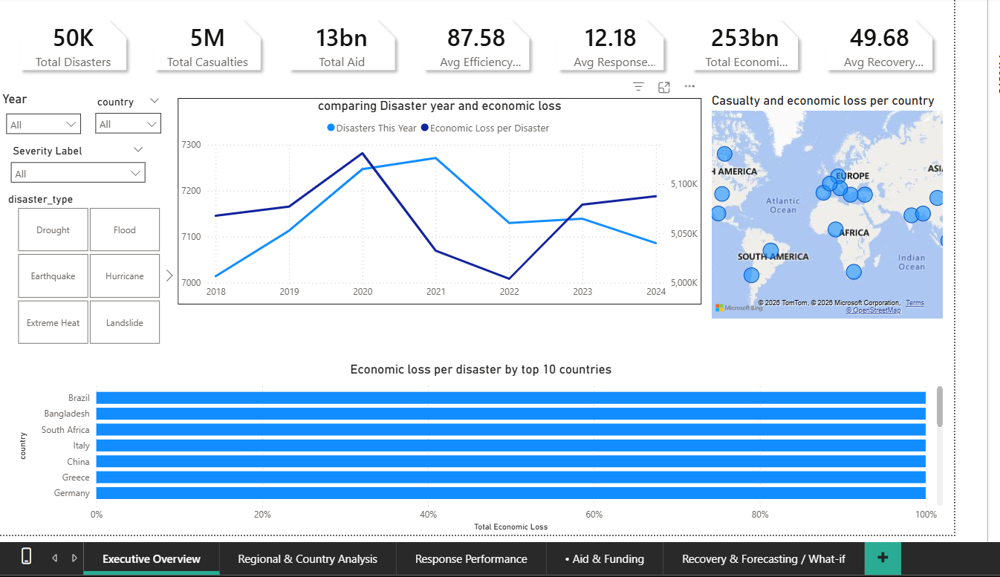

# 🌍 Global Disaster Analytics Dashboard (Power BI)

## 📌 Project Summary
This project presents a **Global Disaster Analytics Dashboard** built using **Power BI** to analyze worldwide disaster data from 2018 to 2024.

It provides insights into:
- Disaster frequency and trends
- Economic impact and casualties
- Response efficiency and recovery duration
- Aid and funding distribution
- Forecasting future disaster patterns

The dashboard is designed to support **data-driven decision-making** for disaster management and planning.

---

## 📂 Dataset Source
- **Dataset:** Global Disaster Data (2018–2024)
- **Type:** Structured dataset (CSV format)

### 📊 Contains:
- Event ID
- Disaster Type
- Country & Region
- Economic Loss (USD)
- Casualties
- Response Time (days)
- Recovery Duration (days)

> ⚠️ Note: A sample dataset is included. Full dataset may be excluded due to size limitations.

---

## ⚙️ How to Run ETL Pipeline

### Step 1: Install Requirements
```bash
pip install -r requirements.txt
```

### Step 2: Run ETL Scripts
```bash
python src/etl/01_load.py
python src/etl/02_clean.py
python src/etl/03_enrich.py
```

### 🔄 ETL Workflow
- `01_load.py` → Loads raw dataset  
- `02_clean.py` → Handles missing values and formatting  
- `03_enrich.py` → Adds calculated fields and features  

📁 Output:
```
data/clean/
```

---

## 📊 How to Open Power BI Dashboard

1. Navigate to:
```
powerbi/GlobalDisasterDashboard.pbix
```

2. Open using:
- Power BI Desktop

3. Explore:
- Filters (Year, Country, Disaster Type)
- Visuals (Maps, Charts, KPIs)

---

## 📷 Dashboard Screenshots

### Executive Overview


### Regional Analysis


### Response Performance


### Aid & Funding


### Recovery & Forecasting


---

## 🛠️ Tools & Technologies
- Power BI  
- DAX (Data Analysis Expressions)  
- Python (ETL Pipeline)  
- Pandas, NumPy  
- Git & GitHub  

---

## 📁 Project Structure
```
global-disaster-dashboard/
├── README.md
├── LICENSE
├── data/
│   ├── raw/
│   ├── clean/
│   └── docs/
├── docs/
├── src/
│   ├── etl/
│   ├── analysis/
│   └── utils/
├── powerbi/
├── notebooks/
├── tests/
├── requirements.txt
└── .github/workflows/
```

---

## 🧠 Key Insights
- Uneven aid distribution across high-impact countries  
- Faster response time leads to shorter recovery duration  
- Floods are frequent, but wildfires cause higher loss per event  
- Higher aid improves efficiency and recovery outcomes  
- Coastal regions show increasing disaster trends  

---

## 🧪 Data Quality Checks
- Data type validation and parsing  
- Missing value handling  
- Duplicate removal  
- Standardization of categories  
- Currency normalization  
- Outlier detection  
- Date consistency (2018–2024)  
- Feature engineering (Severity Index, Year, Region)  

---

## 🚀 Future Improvements
- Real-time data integration  
- Machine learning forecasting  
- Power BI Service deployment  
- API-based ingestion  

---

## 👨‍💻 Author
**Rohit Mirage**  
BCA Student | Data Analyst  

---

## ⭐ Support
If you found this project useful, consider giving it a ⭐ on GitHub!
